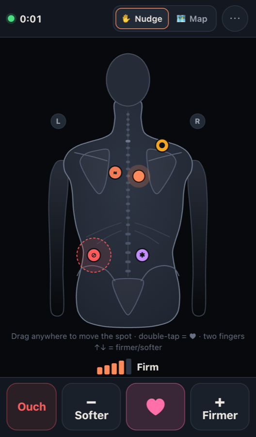
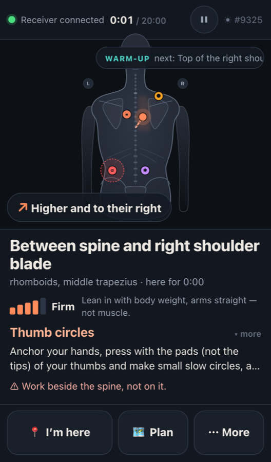
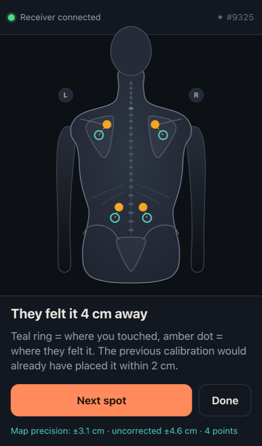

# Right There — prototype

Guide a massage from your phone without saying a word.

- **A — the receiver** lies face down with their phone beside them and moves a finger to show where they want it.
- **B — the giver** props their phone up nearby and sees a map of the back with a dot, what was asked for (firmer, softer, "that's the spot" ♥, ouch), plus technique hints for that spot.
- The two devices connect with a **4-digit code** through a small relay server, or **with no server at all**: they pair by scanning QR codes and talk directly over the Wi-Fi.
- The mapping between finger and back is **calibrated**, and it keeps improving over time.

> Prototype: in-memory sessions, no accounts. Friendly home-massage tips, not medical advice.

| Receiver: touch pad | Giver: live map | Giver: calibration |
| --- | --- | --- |
|  |  |  |

## Try it without any server

`npm run build:single` makes **one self-contained file**, `dist-single/right-there.html`, of about 560 KB.

- **Double-click it on a laptop**, pick a role, and pair a phone:
  1. The phone scans the QR code on the laptop screen with its camera.
  2. The phone shows a reply QR code. Hold it up to the laptop's webcam and tap *Scan their code*, or copy and paste the code (on Apple devices the clipboard syncs).
  3. The devices are connected directly. Nothing runs on a server, and session data never leaves the Wi-Fi.
- **The phone still needs to load the page from somewhere.** Put the same file on any static host, e.g. GitHub Pages. The workflow in `.github/workflows/pages.yml` publishes it on every push to `main` and bakes the Pages address in, so a scanned QR code opens the app straight into pairing.
- **Until it's hosted**, `npm run share` also rebuilds the file so phones load the page through your laptop's tunnel link; the session itself still runs device to device. Alternatively, enter any address where the app is hosted under *Where does the other device open Right There?*
- **Requirements:**
  - Both devices on the same Wi-Fi, or one phone's hotspot. Guest and hotel Wi-Fi often block devices from reaching each other.
  - For other networks, turn on *Not connecting? → public STUN helper* on both devices. That is a hosted service, and some networks still won't connect without a relay.
- **If the connection drops** (a page reload, a phone switched off), the hosting device shows *Reconnect* with a new QR code. The session state lives on the hosting device and continues where it left off.

## Try it with the relay server

```bash
npm install
npm start          # builds, then serves on :3030 (http) and :3443 (https) and prints a QR code
```

- **Two phones anywhere (easiest):** run `npm run share`. It builds, starts the server and opens a free Cloudflare quick tunnel (no account), then prints a public `https://….trycloudflare.com` link with a QR code (also saved to `.share/qr.png`).
  - It uses real HTTPS, so there are no certificate warnings and the screen stays on.
  - The link works on Wi-Fi or mobile data while this computer stays awake and online, and changes on every run. Ctrl+C stops it.
- **Two phones on the same Wi-Fi:** scan the QR code printed in the terminal with each phone, or open the printed `http://192.168.x.x:3030`. On one phone choose *I'm getting the massage*, on the other enter the code shown (or scan the QR on screen).
- **One computer:** open `http://localhost:3030/#/demo` to see both phones side by side. The mouse works: drag on the left phone, double-click = ♥.
- **Development:** `npm run dev` runs Vite with hot reload and the relay built in, on `http://localhost:5173` (also on your LAN IP).

### Phones: keeping the screen on

Both phones sit untouched for minutes, so the app tries to keep the screen awake.

- **Plain `http://` on a LAN:** browsers don't treat this as secure, so the Wake Lock API isn't available. The app falls back to a silent-video trick (NoSleep.js), which works on most phones.
- **Most reliable:** open the printed `https://…:3443` link once and accept the self-signed certificate warning. On iOS that's *Show Details → visit this website*. Then native wake lock works.
- **If all else fails:** set Auto-Lock to *Never* for the session. The status bar shows ☀ when the screen is being kept on.
- **"Add to Home Screen"** gives a full-screen app view.

### Sound and vibration

- **Voice cues (giver):** turn them on in setup or *More → Spoken cues*. Browsers only speak after the first tap on the page.
- **Vibration:** Android vibrates. iPhones have no Vibration API; on iOS 18+ the app uses the switch-toggle haptic trick, which only works on button taps.

## How a session goes

1. **Pair.** Either phone starts a session and shows the code and QR. The other phone joins and gets the other role.
2. **Check-in (A, sitting up).** Tap where it hurts and mark each spot as Knot, Tight, Sore, Stiff, Tender or **Avoid**. Pick your usual pressure, duration and liked techniques, and add notes.
   - B watches it appear live, gets an auto-generated plan (warm-up → focus areas top to bottom → cool-down, with avoid zones) and a prep checklist.
3. **Setup (A, lying down).** Put the phone flat wherever the hand rests. Do two swipes: *neck → lower back* and *left → right*.
   - This works out how the phone lies (any rotation, even a mirror-image mental model) and how sensitive pointing should be.
   - A's map turns to line up with their body. B picks where they're standing (feet, left, right or head), and B's map turns to match what B sees.
4. **Massage.**
   - **A:**
     - Drag anywhere (nudge mode) or touch the picture (map mode).
     - Buttons along the bottom edge: *Ouch · Softer · ♥ · Firmer*.
     - Eyes-free: **double-tap anywhere = ♥**, **two-finger swipe up/down = firmer/softer**, and a haptic tick when the spot crosses into a new area.
     - More: slower, faster, "something different", mark the current spot, pause, redo setup.
   - **B:**
     - A big smoothed dot with a trail, and an arrow plus words for nudges ("A little higher and to their right").
     - The area name, a pressure level with how to apply it, and tempo.
     - A technique card for that area and symptom, with cautions such as spine, neck, kidneys and avoid zones.
     - Banners for feedback, and spoken cues if enabled.
     - Buttons: *I'm here* (tap the map where your hands are to re-sync the dot) and *Plan* (jump to the next focus area).
     - *More → Mark a knot spot* for things you find with your hands. It feeds the hints and next time's check-in.
5. **Summary.** A heat map of where the time went, ♥ and ouch spots, and notes for next time. It's saved on each phone, and A's profile keeps the preferred pressure and the spots.
   - *Another round* keeps everything. *⇄ Swap roles* moves both phones into a fresh session with the roles reversed, so each person keeps their own calibration.

## Calibration

Everything lives on the receiver's phone (`localStorage`) and is reused next session.

| What | How it's learned | Used by |
| --- | --- | --- |
| Phone orientation and mirroring | The two setup swipes, snapped to 90° | Nudge direction, how A's map is drawn |
| Sensitivity | Length and speed of the setup swipes | Nudge mode |
| Auto-tune (×0.5–2) | Overshoot-then-correct lowers it; repeated same-direction "clutching" raises it | Nudge mode, over time |
| Pointing correction | Precision calibration (B presses a landmark, A taps where they feel it), and ♥ followed by B's *I'm here — teach map* | Map mode, over time |

**Pointer ballistics (nudge).** Slow drags move precisely and quick swipes travel far.

**Pointing correction model (map).** A centred, ridge-regularised affine fit plus a conservative local residual field:

- Recent points weigh more.
- Precision is reported as leave-one-out error: typically about ±3 cm after 4 points and about ±1 cm after 10, for a consistent bias.
- B sees the precision and which areas still lack calibration points.

## Architecture

```
src/shared/       pure logic, shared by server and phones (unit-tested)
  session.ts      session state, actions, validation and permissions, the reducer
  calibration.ts  orientation from swipes, map correction model and precision
  nudge.ts        pointer ballistics, auto-tune, nudge wording
  body.ts         the back model in cm (outline, landmarks, clamping)
  regions.ts      named areas (e.g. "Between spine and left shoulder blade")
  techniques.ts   techniques, symptoms, per-area guidance, hints, session plan
  summary.ts      recap
server/
  room.ts         one session's authority: validate, reduce, sequence, dedupe (relay AND no-server host)
  relay.ts        rooms and seats, sequencing, heartbeat, REST (/api/rooms, /claim, /info)
  index.ts        production server: static dist/, relay, HTTPS with a self-signed cert, terminal QR
src/client/       React UI (receiver/ and giver/ screens, BackMap SVG, TouchPad)
  lib/connection.ts   replica + pluggable Link: WebSocket, WebRTC data channel, or in-page
  p2p/signal.ts       WebRTC offer/answer squeezed to ~160 characters for QR codes
  p2p/peer.ts         data channel setup without a signaling server
  p2p/host.ts         no-server host: runs room.ts for its own screen and the partner's channel
```

- **One authority, two deployments.** The relay server, or in no-server mode the hosting device, validates each action, applies it with the shared reducer and broadcasts it with a sequence number. Both devices apply the same actions in the same order, so all copies stay identical.
- **No-server pairing.** A WebRTC offer or answer only needs its ICE credentials, the DTLS fingerprint and a few candidates. These travel as a ~160-character code (a QR code, or copy/paste), and the other side rebuilds a standard SDP from them. By default no STUN or TURN servers are used: devices on the same network find each other by their local addresses.
- **Reconnects are cheap.** A reconnecting phone (lock screen, Wi-Fi hiccup) gets a snapshot, and gaps trigger a resync.
- **Nothing important gets lost.** Every action except live pointing carries an id. A phone keeps it until the server echoes it, and resends it after reconnecting; the server drops duplicates.
  - Stale feedback (older than 8 s) is dropped rather than replayed late.
  - End and restart carry the round number, so a late replay can't end a newer round.
- **Seats are tokens.** A lost phone can take over a disconnected seat.

## Tests

```bash
npm test           # unit + relay integration tests (vitest)
npm run typecheck
npm run dev & npm run e2e   # two simulated phones in headless Chrome play a whole session and save screenshots to /tmp/mb-shots
npm run e2e:p2p             # no-server: file:// host + phone over WebRTC, camera QR scan, then Chrome ↔ WebKit (Safari engine) pairing
```

The cross-engine check needs Playwright's WebKit once: `npx playwright-core install webkit`.

## Deploying

This is a single Node process with in-memory rooms, so it needs one instance with WebSocket support (e.g. Render, Fly.io, Railway). Use `npm run build` then `npm run serve`, with `PORT` set; set `HTTPS=0` behind a TLS-terminating host.

For a quick public HTTPS URL to your laptop, a tunnel such as `cloudflared tunnel --url http://localhost:3030` works too. Note that this exposes the server publicly.

## Known limits and next ideas

- **Current limits:**
  - Rooms are lost when the server restarts. In no-server mode, reloading the hosting device's page ends the session.
  - 4-digit codes suit local and trusted use.
  - Anyone with the code can take over a *disconnected* seat.
  - The back model is one average adult shape. Calibration absorbs personal differences in pointing, but not body proportions.
- **Next ideas:**
  - body-size presets;
  - holding a finger still as "stay here";
  - a smartwatch as A's remote;
  - multiple receiver profiles per phone;
  - voice input for A.
