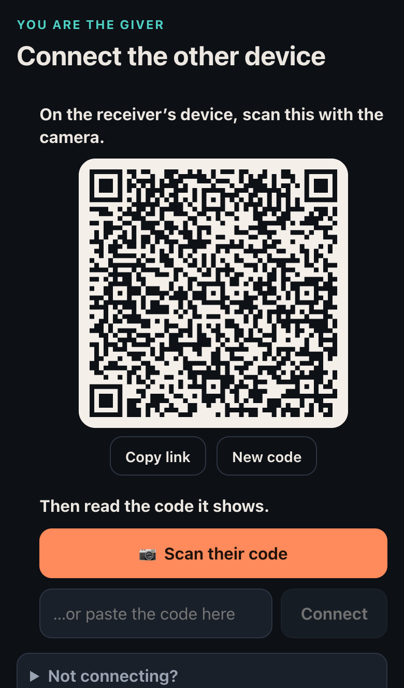
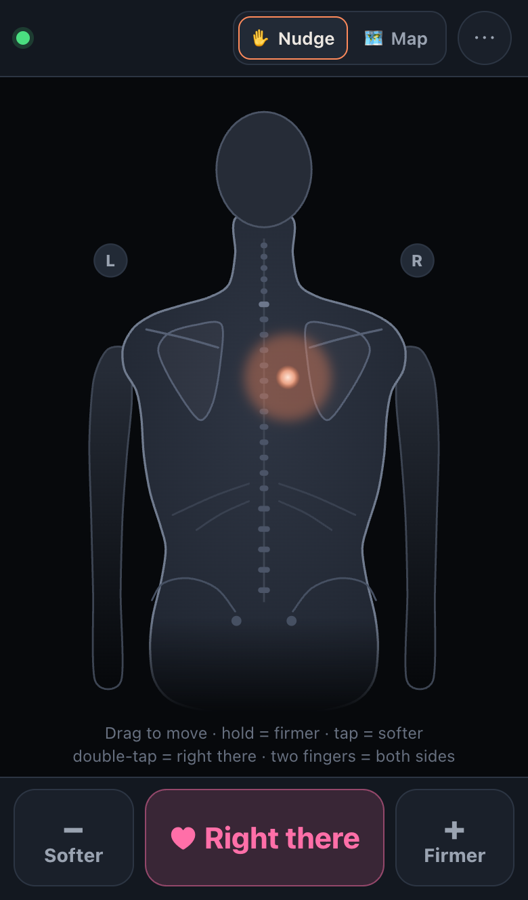
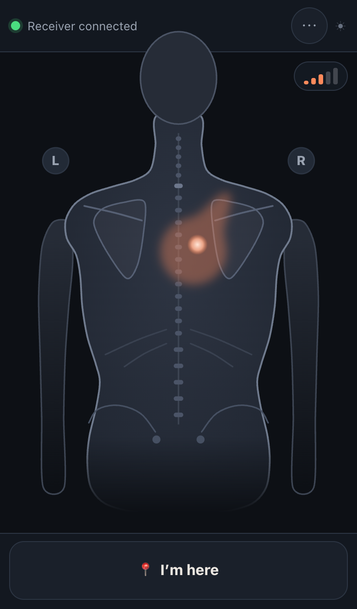

# Right There

Show your partner where to massage, without saying a word.

The **receiver** lies face down with their phone beside them and moves a finger to show where they want the hands. The **giver** sees the spot as a glow on a map of the back. Double-tap when it's *right there*.

**Start at https://tsterker.github.io/right-there/** on the giver's screen; a laptop is perfect. *Try the demo* there shows both screens side by side, already connected. Prototype. There's no server: the two devices talk to each other directly over the Wi-Fi.

| Pair | Receiver | Giver |
| :-: | :-: | :-: |
|  |  |  |

## How it works

1. **Pair.** The giver taps *Start as the giver*. The receiver scans the QR code with their phone's camera app; the link opens Right There, which shows a reply code. They hold it up to the giver's camera, and the two are connected. Scanning in the app uses the back camera (*Switch camera* flips it). Camera not working? The screen says why; *Share link* sends the reply by Messages, AirDrop or WhatsApp. Tapping it on the giver's device connects, if it opens in the browser showing the QR code (a new tab hands it over, no server); otherwise paste the message, and the paste box finds the code in it.
2. **Two swipes (receiver).** Put the phone flat where your hand rests. Swipe *neck → lower back*, then *left → right*. This tells the app how the phone is lying. Next time you can tap *Same as last time*.
3. **Guide.**
   - **Receiver:**
     - *Nudge*: drag anywhere, like on a trackpad. Slow drags are precise, quick ones travel far.
     - *Map*: touch the spot on the picture.
     - **Double-tap anywhere = right there.**
     - **Two-finger tap = both sides** (experimental): one hand on each side of the spine. The giver sees one shared shape: it widens and narrows as the hands should move apart or together, with arrowheads at its ends, and one arrowhead on the spine for up and down. Where a drag starts picks the hand it steers: start on the right half of the back to lead with the right hand, on the left half for the left. Each hand stops at the spine; touching a spot in map mode steers that side. Tap again for one side.
   - **Giver:** chooses once where they're standing, so the map matches what they see. Then sees the spot as a palm-sized glow: roughly where the hands should be, not an exact point. A nudge pings as it starts, and while the finger moves the glow smudges toward where the spot is going right now, further for faster moves. About a second after the finger lifts it's a round glow again, so what points is always fresh. Optional spoken cues say it in words ("higher and to their right", the area's name). *I'm here* moves the spot to where the hands really are.

- **Map mode learns.** After a double-tap on a spot touched in map mode, the giver taps *I'm here — teach map* and then taps where their hands are. The receiver's phone saves the pair and uses it to correct later touches.
- **Swap roles:** *⋯ → Swap roles* keeps the same connection.
- **Dropouts:** if one device drops out, the other shows *Reconnect* with a new QR code, and the session picks up where it left off.
- **Network:** both devices need the same Wi-Fi, or one phone's hotspot. Guest and hotel Wi-Fi often block devices from reaching each other. *Not connecting? → public STUN helper* can help.
- **Vibration:** on Android, the receiver's phone ticks when the spot enters a new area. iPhones don't let web pages vibrate.

## Development

```bash
npm install
npm run dev          # http://localhost:4747 with hot reload
npm run dev:phone    # the same, plus a temporary HTTPS link for the phone
```

- **Testing with a phone.** Open `http://localhost:4747` on the computer. Its QR codes point the phone at the dev server, and edits reload on both screens.
  - **`npm run dev`:** the phone uses this computer's Wi-Fi address over plain HTTP.
  - **`npm run dev:phone`:** the phone gets HTTPS through a Cloudflare quick tunnel (no account needed). Its camera and screen-on then work too.
- **Both screens in one window:** the demo (`http://localhost:4747/#/demo`) links them directly, without pairing. Drag on the receiver with the mouse; double-click = right there.
- **Checks:** `npm test` · `npm run typecheck` · `npm run e2e`. The e2e run builds the app, then drives Chrome and WebKit through a whole session. It needs Google Chrome, plus `npx playwright-core install webkit` once.
- **README screenshots:** `npm run screenshots` refreshes `docs/*.png`.
- **Build and publish:** `npm run build` writes one self-contained file, `dist/index.html` (also copied to `dist/right-there.html`), which works on any static host or opened from disk. Every push to `main` publishes it to GitHub Pages.
- **Forks** publish to their own `https://<you>.github.io/<repo>/`. For local builds, put that address in `.env.production`; QR codes shown by a copy opened from disk use it.

```
src/shared/          pure logic, unit-tested
  session.ts         shared state (the spot, "right there"), actions, validation
  room.ts            the hosting device's authority: validates, applies and numbers actions
  calibration.ts     phone orientation from the swipes, map-mode correction
  nudge.ts           pointer ballistics, auto-tune, nudge wording
  body.ts regions.ts the back model (in cm) and its named areas
src/client/
  p2p/               pairing without a signaling server: WebRTC offer/answer squeezed into ~160-character QR codes
  lib/connection.ts  each device's copy of the session
  screens/           landing, pairing, receiver (swipes, touch pad), giver (map)
```

The device that starts the session hosts it. It applies every action and sends it, numbered, to both screens, so the two copies stay identical. A device that reconnects gets a fresh snapshot, and anything it sent that wasn't confirmed is resent without being applied twice.
